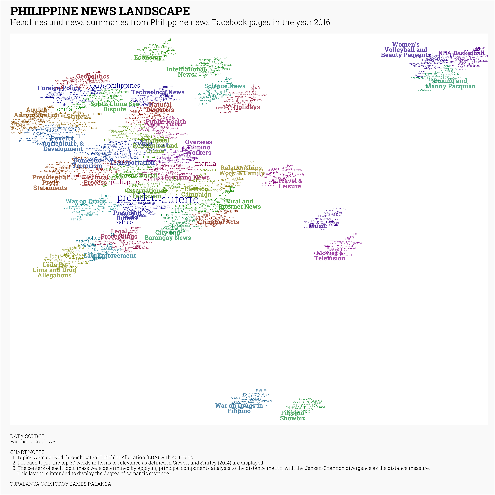
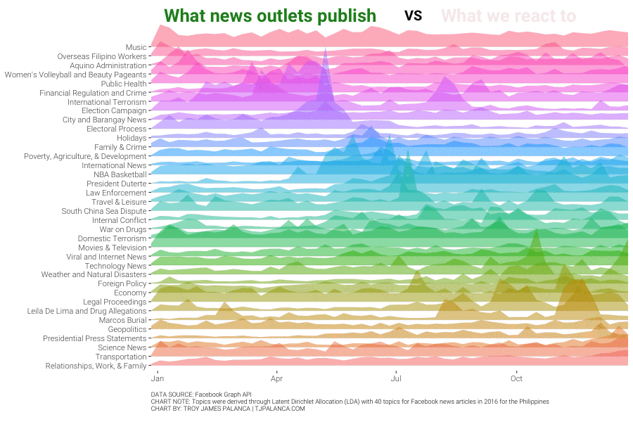

## Background

### Motivation

A common subject of debate in how media relays information to the public is the relative coverage that a particular topic receives in their Facebook feeds. We attempt to objectively answer this question by using topic modelling techniques.

### Methodology

In order to determine the distribution of topics that news websites cover, we need to find a way to map the the headline, caption, and other raw text to a particular topic, without having prior knowledge on what those topics are. This translates to an unsupervised classification problem on natural language. One of the most common algorithms for dealing with this information is **Latent Dirichlet Allocation (LDA).**^[[Blei, Ng, & Jordan (2003). Latent Dirichlet Allocation. *Journal of Machine Learning Research 3 (2003) 993-1022*.](http://jmlr.csail.mit.edu/papers/v3/blei03a.html)]

This model views the text generation process as conforming to the following characteristics: 

  * **A topic is a mixture of non-exclusive words.** A topic is comprised of many words, and each word maps to one or more topics.
  * **A document (in this case, a news post), is a mixture of topics.** Each document can be thought of as containing a proportion of words from each topic.

LDA is the algorithm that simultaneously maps words to topics and topics to documents. One of the important considerations of this model is that the number of topics $k$ must be known a-priori.

See [here](https://www.youtube.com/watch?v=3mHy4OSyRf0) for an excellent detailed video explanation of the LDA algorithm, [here](http://www.jmlr.org/papers/volume3/blei03a/blei03a.pdf) for the seminal paper on the algorithm, and [here](https://cran.r-project.org/web/packages/topicmodels/vignettes/topicmodels.pdf) for the specific implementation in R.

## Preliminaries

We load libraries needed for this analysis.

```{r Setup}

suppressPackageStartupMessages({
  library(dplyr)       # Data manipulation
  library(stringr)     # String manipulation
  library(lubridate)   # Date and time manipulation
  library(purrr)       # Functional programming
  library(tidyr)       # Reshaping
  library(magrittr)    # Advanced piping
  library(pushoverr)   # Pushover notifications
  library(doMC)        # Parallel Computing
  library(readr)       # Importing data
  library(tibble)      # Better data frames
  
  library(ggplot2)     # Static data visualization
  library(ggrepel)     # Repel text labels
  library(ggiraph)     # GGplot interactive
  library(scales)      # Scales
  library(viridis)     # Viridis color scales
  library(htmlwidgets) # JS visuliaztions
  library(htmltools)   # Arbitrary html
  library(ggjoy)       # Create joyplots
  library(gganimate)   # Animating ggplots
  library(tweenr)      # Tweening charts
  
  library(httr)        # HTTP functions
  library(jsonlite)    # JSON parsing
  
  library(tidytext)    # Tidy text mining
  library(hunspell)    # Text processing
  library(stringdist)  # String distances
  library(topicmodels) # Topic modelling
  library(proxy)       # Distance measures
})

# Set proper working directory
if (!str_detect(getwd(), "src")) setwd("src")

# Theming
quartzFonts(
  Roboto = 
    c("Roboto-Light",
      "Roboto-Bold",
      "Roboto-Regular",
      "Roboto-Thin")
)

theme_set(
  theme_bw(base_family = "Roboto", base_size = 14) +
    theme(
      plot.title = element_text(face = "bold", size = 14, 
                                margin = margin(0, 0, 4, 0, "pt")),
      plot.subtitle = element_text(size = 12),
      plot.caption = element_text(size = 6, hjust = 0),
      axis.title = element_text(size = 10),
      panel.border = element_blank()
    )
)

# Functions
source("../func/01-page-scraping-functions.R")
source("../func/02-topic-modelling-functions.R")

```

```{r caching, echo = FALSE}

load("../cache/final_data.rda")
knitr::opts_chunk$set(eval = FALSE, warning = FALSE)

```


## Data Import

From the data that we have extracted via the Facebook Graph API (details can be found [here](http://www.tjpalanca.com/static/20170208-fb-scraping.html)).

```{r Data extraction}

# Create linkage to database
src_sqlite(
  path   = "../dta/03-fbpages.sqlite",
  create = FALSE
) -> fbpages.sqlite

# Define required tables
fbpages.sqlite %>% tbl("fact_posts") -> posts.sql
fbpages.sqlite %>% tbl("fact_posts_attachments") -> attachments.sql

# Load data
posts.sql %>% 
  left_join(attachments.sql, by = c("post_id" = "object_id")) %>% 
  collect(n = Inf) ->
  posts.dt

# Cache data
save(posts.dt, reactions.dt, file = "../cache/raw_data.rda") 

# Load top 100 fbpages dataset
top_100_fbpages.dt <- readRDS("../dta/04-news-pages.rds")

```

```{r Data cleaning}

posts.dt %>% 
  # Remove duplicates
  group_by(post_id) %>% 
  filter(row_number() == 1) %>% 
  ungroup() %>% 
  # Timestamp type and timezone conversion
  mutate(
    post_timestamp_utc = 
      post_timestamp_utc %>%
      as.POSIXct(origin = "1970-01-01", tz = "UTC"),
    post_timestamp_local = 
      post_timestamp_utc %>% 
      with_tz("Asia/Manila")
  ) ->
  posts_clean.dt

```

## Data Augmentation

We require additional fields in order to make the analysis richer. We query from the Facebook Graph API for the `description`, `url`, and `attachment_media_src` field of the attachments.

```{r Data augmentation}

if (!file.exists("../cache/topic-modeling-posts-augment.rds")) {
  
  # Authenticate
  load("../bin/fb_auth.rda")
  
  getAppAccessToken(
    fb_app_id = fb_app_id,
    fb_app_secret = fb_app_secret
  )
  
  # Create augmentation function
  getFBAttachmentData <- function(post_ids, partition) {
    cat(unique(partition), "\n")
    Sys.sleep(0.5)
    callFBGraphAPI(
      node  = "attachments",
      query = list(
        ids = paste0(post_ids, collapse = ","),
        fields = "description,url,media{image{src}}"
      )
    )
  }
  
  # Loop over attachments and prepare data
  posts_clean.dt %>% 
    mutate(partition = ceiling(row_number()/20)) %>% 
    split(.$partition) %>% 
    map(~getFBAttachmentData(.$post_id, .$partition)) ->
    posts_augment.ls
  
  # Flatten and process data
  posts_augment.ls %>% 
    map(~map(., "data")) %>% 
    flatten_df("post_id") %>% 
    mutate(media = map_chr(media, ~.$src %||% NA_character_)) %>% 
    rename(
      attachment_description = description, 
      attachment_url         = url,
      attachment_media_src   = media
    ) -> 
    posts_augment.dt
  
  # Save to cache
  saveRDS(posts_augment.dt, "../cache/topic-modeling-posts-augment.rds")
} else {
  readRDS("../cache/topic-modeling-posts-augment.rds") ->
    posts_augment.dt
}

```

Now that all data transforms are complete, we consolidate objects in memory.

```{r Consolidation}

# Join to original table
posts_clean.dt %>% 
  left_join(posts_augment.dt, by = "post_id") %>% 
  select(-attachment_media_url) ->
  posts_complete.dt

# Filter to 2016 posts and rename to original file
posts_complete.dt %>% 
  filter(year(post_timestamp_local) == 2016) -> 
  posts.dt

# Remove objects in memory
rm(posts_augment.dt, posts_clean.dt, posts_complete.dt, posts_augment.ls)

```

## Pre-processing

We use a Tagalog hunspell library created by Jan Alonzo (GNU GPLv2) for the succeeding parts of this analysis.

### Shaping

For this analysis, we only include post types that do easily lend themselves to text analysis, therefore video, photo, and other complex post types are removed; only types `share` and `quoted_share` are included.

In this dataset, we have three columns of text data on which to perform our analysis:

  * `post_message` - the message that appears on the top of the article and is written for each post,
  * `attachment_title` - the title of the linked article, usually the headline, and 
  * `attachment_description` - the summary text appearing below the title, usually an excerpt of the full article linked.
  
We took a look at possible discrepancies in the data by looking at cases where any of these columns are empty - we have isolated them as either data errors or deliberately empty. In either case, they do not warrant special treatment.

We simple construct the raw text field by concatenating the three columns, separated by a space. We then tokenize it by word to transform into tidy format.

```{r Data shaping}

posts.dt %>% 
  # Filter to text types only
  filter(attachment_type %in% c("share", "quoted_share")) %>% 
  # Construct text field 
  unite(text, post_message, attachment_title, attachment_description, sep = " ") %>% 
  # Retain only relevant columns 
  select(post_id, text) %>% 
  # Tokenize by word
  unnest_tokens(word, text, token = "words", to_lower = TRUE) %>%
  unnest_tokens(word, word, token = "regex", pattern = "[.]", collapse = FALSE) %>% 
  unnest_tokens(word, word, token = "regex", pattern = "[_]", collapse = FALSE) %>% 
  unnest_tokens(word, word, token = "regex", pattern = "[:]", collapse = FALSE) %>% 
  # Cleaning apostrophe words 
  mutate(word = word %>% str_replace("['’‘].*$", "")) ->
  # Assign to variable
  posts_tokenized.dt

```

### Invalid characters and words

We first try to filter out words with invalid characters and numbers.

```{r Show unique characters}

# Get unique characters
posts_tokenized.dt %>% 
  distinct(word) %>% 
  mutate(word = iconv(word, to = "UTF-8")) %>% 
  mutate(chars = str_split(word, pattern = "")) %$%
  flatten_chr(chars) %>% 
  unique() -> 
  unique_characters.vec

unique_characters.vec

```

As you can see there are quite a few characters that don't make sense. We remove words that contain invalid characters.

```{r Remove words with invalid characters}

# Get invalid characters
unique_characters.vec[!str_detect(unique_characters.vec, "[a-zá-ž]")] %>%
  { paste0("[", paste0(., collapse = ""), "]") } -> 
  invalid_characters.rgx

# View words with invalid characters 
posts_tokenized.dt %>% 
  filter(!str_detect(word, invalid_characters.rgx)) ->
  posts_tokenized.dt

```

We also remove words that are less than 3 characters long. 

```{r Remove short words}

# Remove short words
posts_tokenized.dt %>% 
  filter(str_length(word) >= 3) ->
  posts_tokenized.dt

```

### Spell checking

Given that this is post information and not comments, we don't have to do much spell checking, but we do so as a precautionary step.

```{r Sample spell checking}

posts_tokenized.dt %>% 
  # Tagalog and English spell checks
  filter(!hunspell_check(word, "tl_PH") & !hunspell_check(word, "en_US")) %>%
  distinct(word) -> 
  posts_misspelled_words.dt

posts_misspelled_words.dt %>% sample_n(1000) %$% word
  
```

It seems that most of the words that do not pass the spell check are either not in the dictionary or are proper nouns. We therefore decide that it's not worth correcting the spelling as it will probably impact the true meaning of the words.

### Stemming

Stemming is process of converting words into their root words, so we get to the root idea of the issue and relate similar words to each other. Stemming implemented by `hunspell` and `SnowballC` seems to be too strict, so we implement the following stemming patterns (regex):

  * English: "es$", "s$", "ed$", "d$", "ing$", "ly$"
  * Tagalog: "^nag", "^na", "um", "in", "an$", "in$"

```{r Stem word samples}

# Compute stem words
posts_tokenized.dt %>% 
  stemWords(c("es$", "s$", "ed$", "d$", "ing$", "ly$"), "en_US") ->
  posts_stems_en.dt

posts_tokenized.dt %>% 
  stemWords(c("^nag", "^na", "um", "in", "an$", "in$"), "tl_PH") ->
  posts_stems_tl.dt

# Show some examples
posts_stems_en.dt %>% sample_n(20)
posts_stems_tl.dt %>% sample_n(20)

```

```{r Stemming}

# Check no overlap between tagalog and english stem words
stopifnot(
  intersect(posts_stems_tl.dt$word, posts_stems_en.dt$word) %>% length() == 0
)

# Combine
posts_stems.dt <- 
  rbind(
    posts_stems_en.dt,
    posts_stems_tl.dt
  )

# Add to tokenized posts
posts_tokenized.dt %>% 
  left_join(posts_stems.dt, by = "word") %>% 
  mutate(word = ifelse(is.na(stem_word), word, stem_word)) %>% 
  select(-stem_word) -> 
  posts_tokenized.dt

# Clean up
rm(posts_stems.dt, posts_stems_en.dt, posts_stems_tl.dt)

```

### Stop Words

We first eliminate stopwords, i.e. words that are common to a language and do not contain meaning. For the purpose of this model, we use stopwords for English and Filipino/Tagalog.

```{r Stop word removal}

# Collect English and Tagalog stopwords
stopwords.ls <- c(
  stop_words$word, 
  fromJSON(
    "https://raw.githubusercontent.com/stopwords-iso/stopwords-tl/master/stopwords-tl.json"
  ),
  # Manual stopwords
  "thy", "monday", "tuesday", "wednesday", "thursday", "friday", "saturday", "sunday",
  "befullyinformed", "sen", "cnn", "final", "start", "san", "anti", "http", "https",
  "iii"
)

# Filter out stopwords
posts_tokenized.dt %>% 
  filter(!word %in% stopwords.ls) -> 
  posts_tokenized.dt

```

### Filtering and Casting

We summarise the data format into a more compressed form and convert it into a document term matrix.

```{r Term Frequency}

# Summarise
posts_tokenized.dt %>% 
  group_by(post_id, word) %>% 
  summarise(term_frequency = n()) %>% 
  ungroup() ->
  posts_tokenized.dt

```

We remove words that do not appear in at least 5 documents (3 posts are totally eliminated).

```{r Remove rare words}

# Select rare words
posts_tokenized.dt %>% 
  group_by(word) %>% 
  summarise(count = n()) %>% 
  ungroup() %>% 
  filter(count < 5) ->
  posts_rare_words.dt

# Remove rare words
posts_tokenized.dt %>% 
  anti_join(posts_rare_words.dt, by = "word") ->
  posts_tokenized.dt

# Clean up
rm(posts_rare_words.dt)

```

```{r Cast to DTM}

# Convert to document term matrix
posts_tokenized.dt %>% 
  cast_dtm(post_id, word, term_frequency) ->
  posts_tokenized.dtm

```

## Analysis

### Topic modelling

#### Setting the number of topics

In order to determine the ideal number of topics $k$, we perform 5-fold cross validation on [perplexity](https://en.wikipedia.org/wiki/Perplexity) at different values of $k$. We then compute the rate of perplexity change (RPC) and use the elbow point as the ideal number of topics. This method is detailed in Zhao et al (2015)^[[Zhao et al (2015). A heuristic approach to determine an appropriate number of topics in topic modeling. *BMC Bioinformatics 2015(16)*.](https://www.ncbi.nlm.nih.gov/pmc/articles/PMC4597325/)].

On a 10% random sample, we estimate the perplexity using 5-fold cross validation for different values of $k$.

```{r Cross validating k}

set.seed(7292)
crossValidatePerplexity(
  dtm          = posts_tokenized.dtm[
    sample(1:posts_tokenized.dtm$nrow, posts_tokenized.dtm$nrow * 0.1),],
  n_folds      = 5,
  k_candidates = c(10, 15, 20, 25, 30, 35, 40, 45, 50),
  method       = "Gibbs"
) -> 
  posts_tokenized_perplexity_cv.dt

```

```{r Plot cross validation results, eval = TRUE}

plotCrossValidatedPerplexity(posts_tokenized_perplexity_cv.dt) +
  annotate("segment", x = 40, xend = 40, y = -Inf, yend = Inf, color = "red") +
  labs(
    title = "RATE OF CROSS-VALIDATED PERPLEXITY CHANGE",
    subtitle = 
      "Change in LDA Perplexity, 5-fold cross validation, 2016 Facebook News Corpus",
    x = "Number of Topics (k)",
    y = "Rate of Perplexity Change\n(units/marginal topic)",
    caption = "\nLine indicates average perplexity change\nPoints indicate folds"
  )  

```

*Note: this took 8 hours to run in parallel on 3 cores.*

As you can see, the change point (where the rate of perplexity change no longer falls significantly with additional topics) is at 40 topics.

#### LDA Training

We then train the LDA on the full dataset, with $k = 40$.

```{r LDA training}

# Train the LDA model
LDA(
  x       = posts_tokenized.dtm,
  k       = 40,
  method  = "Gibbs",
  control = list(seed = 7292)
) -> posts.lda

```

Training took 2 hours on the full dataset. We extract the word-topic probabilities, and the document-topic probabilities produced by the model.

```{r Extract wtp and dtp}

# Word-topic probabilities
posts.lda %>% tidy("beta") -> posts.wtp

# Document-topic probabilities
posts.lda %>% tidy("gamma") -> posts.dtp

```

#### Topic Labeling

We can then assess the word-topic probabilities in order to get an idea of the topic that is most.

Since we have over 30,000 unique terms in the corpus, we need to extract the top few words that most uniquely define each topic, so that we can more easily visualize and label them. We use the measure of relevance defined by Sievert and Shirley (2014)^[[Sievert and Shirley (2014). LDAvis: A method for visualizing and interpreting topics. *Stanford University.*](http://nlp.stanford.edu/events/illvi2014/papers/sievert-illvi2014.pdf)]. Relevance of term $w$ to topic $k$ given a weight parameter $\lambda$ between 0 and 1 $r(w, k | \lambda)$ is computed as:

$$
r(w, k | \lambda) = \lambda\log(\phi_{kw}) + (1-\lambda)\log(\frac{\phi_{kw}}{p_w})
$$

where $\phi_{kw}$ is the probability of term $w$ for topic $k$, and $p_w$ is the empirical probability of the word in the corpus. $\lambda$ can be thought of as a weighting term between ranking by the probability of that word within the topic, and ranking by the lift over the overall probability in the corpus.

In user studies, Sievert and Shirley (2004) found that a lambda value of 0.6 as an optimal value for allowing humans to identify the topics associated with the top words ranked by relevance. We use this same value for lambda.

```{r Compute relevance}

posts.wtp %>%
  # Compute lambda and phi_kw
  mutate(lambda = 0.6, phi_kw = beta) %>% 
  # Compute and join the p_w
  left_join(
    posts_tokenized.dt %>%
      group_by(word) %>% 
      summarise(frequency = sum(term_frequency)) %>% 
      ungroup() %>% 
      mutate(p_w = frequency/sum(frequency)) %>% 
      select(-frequency),
    by = c("term" = "word")
  ) %>%
  # Compute the relevance
  mutate(relevance = lambda * log(phi_kw) + (1 - lambda) * log(phi_kw/p_w)) ->
  word_relevance.dt

```

We take a look at samples of articles labeled with the topics and the most relevant words that use them, and label them according to the prevalent theme. These are recorded in a csv file and loaded in:

```{r Loading topic mappings}

# Read in topics mapping data
topics_mapping.dt <- read_csv("../dta/lda-topics.csv", col_types = "icc")

```

We extract the top 30 most relevant words and plot them as follows:

  1. Compute the Jensen-Shannon divergence between each of the topics according to the differences in their word-topic probabilities and construct a distance matrix,
  2. Apply principal coordinates analysis in order to project the distance matrix down to two dimensions.
  3. Plot each word near the center of the topic mass and repel them from each other.

```{r News Landscape map}

posts.wtp %>% 
  # Compute Jensen-Shannon
  computeJensenShannonPCA() %>% {
    
    # Assign positions to top 30 most relevant words
    left_join(
      .,
      word_relevance.dt %>% 
        group_by(topic) %>% 
        top_n(30, relevance) %>% 
        ungroup(),
      by = "topic"
    ) -> topic_labelling_top30words.dt
    
    # Assign positions to topic labels
    left_join(
      .,
      topics_mapping.dt,
      by = "topic"
    ) -> topic_labelling_topics.dt
    
    ggsave(
      plot = {
        topic_labelling_top30words.dt %>% 
          ggplot(aes(x = x, y = y)) +
          geom_text_repel(
            aes(label = term, 
                color = factor(topic, levels = 1:40), 
                size = phi_kw * p_w), 
            lineheight = 0.6, 
            segment.size = NA,
            box.padding = unit(0, "lines"),
            force = 0.05,
            family = "Roboto"
          ) +
          geom_text_repel(
            data = topic_labelling_topics.dt,
            aes(label = str_wrap(topic_name, 15),
                color = factor(topic, levels = 1:40)),
            size = 2.25, lineheight = 0.7,
            segment.size = 0.5, alpha = 0.7,
            family = "Roboto", fontface = 2,
            force = 0.3
          ) +
          scale_size_continuous(range = c(1, 4)) +
          scale_color_manual(
            values = rainbow(40) %>% 
              adjustcolor(red.f = 0.6, green.f = 0.6, blue.f = 0.6)
          ) +
          theme(
            axis.title = element_blank(),
            axis.text  = element_blank(),
            axis.ticks = element_blank(),
            panel.grid = element_blank(),
            panel.border = element_blank(),
            plot.background = element_rect(fill = "#FAFAFA"),
            legend.position = "none"
          ) +
          labs(
            title    = "PHILIPPINE NEWS LANDSCAPE",
            subtitle = "Headlines and news summaries from Philippine news Facebook pages in the year 2016",
            caption = 
"DATA SOURCE: Facebook Graph API

CHART NOTES:
  1. Topics were derived through Latent Dirichlet Allocation (LDA) with 40 topics
  2. For each topic, the top 30 words in terms of relevance as defined in Sievert and Shirley (2014) are displayed
  3. The centers of each topic mass were determined by applying principal components analysis to the distance matrix, with the Jensen-Shannon divergence as the distance measure. 
      This layout is intended to display the degree of semantic distance.

TJPALANCA.COM | TROY JAMES PALANCA"
          )
      },
      filename = "../figs/01-news-landscape-map.png",
      device = "png",
      dpi = 600
    )
    
  }

```



Now that we have labelled each topic, we produce sample documents classified to that topic for reference. We produce a random sample of 10 posts from the 300 highest probability fits per topic.

```{r Document classification}

set.seed(9272)
posts.dtp %>% 
  group_by(post_id = document) %>% 
  summarise(topic = min(topic[gamma == max(gamma)]), gamma = max(gamma)) %>% 
  ungroup() %>% 
  inner_join(posts.dt %>% select(post_id, attachment_title), by = "post_id") %>% 
  inner_join(topics_mapping.dt, by = "topic") %>% 
  mutate(topic_title = 
           paste0("Topic ", formatC(topic, flag = "0", width = 2), 
                  " - ", topic_name)) %>% 
  group_by(topic_name) %>% 
  top_n(300, gamma) %>%
  sample_n(10) %>% 
  mutate(row = row_number()) %>% 
  ungroup() ->
  posts_classification.sdt

```

We produce a chart that shows this in a presentable manner.

```{r Document classification chart}

ggsave(
  plot = {
    posts_classification.sdt %>% 
      ggplot(aes(x = 0, y = row, color = factor(topic, levels = 1:40))) +
      facet_wrap(~topic_title, ncol = 5) +
      geom_text(
        aes(label = attachment_title),
        size = 2, hjust = 0, family = "Roboto"
      ) +
      geom_point(aes(x = -0.025), size = 0.5) +
      scale_x_continuous(limits = c(-0.05, 1), expand = c(0, 0)) +
      scale_color_manual(
        values = rainbow(40) %>% 
          adjustcolor(red.f = 0.6, green.f = 0.6, blue.f = 0.6)
      ) +
      theme(
        axis.title       = element_blank(),
        axis.text        = element_blank(),
        axis.ticks       = element_blank(),
        panel.grid       = element_blank(),
        strip.background = element_blank(),
        panel.border     = element_blank(),
        strip.text       = element_text(face = "bold", hjust = 0, size = 6),
        plot.background  = element_rect(fill = "#FAFAFA"),
        legend.position  = "none"
      ) +
      labs(
        title    = "PHILIPPINE NEWS LANDSCAPE",
        subtitle = "Sample news articles from Facebook in the year 2016",
        caption  = 
"DATA SOURCE: Facebook Graph API

CHART NOTES:
  1. Topics were derived through Latent Dirichlet Allocation (LDA) with 40 topics
  2. Documents were classified according to the topic that has the highest probability

TJPALANCA.COM | TROY JAMES PALANCA"
      )
  },
  device = "png",
  filename = "../figs/02-topic-classification-sample.png",
  dpi = 600, height = 10, width = 16
)

```


### Topic Trends

We classify each document based on which topic has the highest probability. If one or more topics have equal probability, then the count is assigned equally to all the topics.

```{r Topic classification}

posts.dtp %>% 
  group_by(document) %>% 
  filter(gamma == max(gamma)) %>% 
  mutate(allocation = 1/n()) %>% 
  ungroup() ->
  posts_classification.dt

```

We construct a chart that allows us to explore topic trends, both in terms of document count and the total number of reactions on the articles of that particular topic.

```{r Data for topic trends chart}

set.seed(7292)
posts_classification.dt %>% 
  # Add post information
  inner_join(
    posts.dt %>% 
      select(document = post_id, post_timestamp_utc, 
             attachment_title, attachment_target_url) %>% 
      mutate(post_period = 
               post_timestamp_utc %>% 
               with_tz("Asia/Manila") %>% 
               floor_date("week")) %>% 
      filter(year(post_period) == 2016),
    by = "document"
  ) %>% 
  # Add topic information
  left_join(topics_mapping.dt, by = "topic") %>%
  # Summarise into tidy dataframe
  group_by(post_period, topic_name) %>% 
  summarise(
    articles = sum(allocation),
    sample_articles = 
      paste0("<li>", sample(attachment_title, 3), "</li>", collapse = "<br>")
  ) %>% 
  ungroup() %>% 
  mutate(
    tooltip_text = 
      paste0(
        "<b>", topic_name, "</b> in period of <b>", post_period, "</b><br>",
        "<b>Number of Articles:</b> ", comma(round(articles, 0)), "<br>",
        "<b>Sample Articles:</b><br><ul>", sample_articles, "</ul>"
      )
  ) %>% 
  # Mark peaks 
  group_by(topic_name) %>% 
  mutate_at(
    vars(articles), 
    funs(mean = mean(.), sd = sd(.), zscore = (. - mean(.))/sd(.))
  ) %>% 
  ungroup() %>% 
  mutate_at(
    vars(ends_with("zscore")),
    funs(peak = . >	1.96)
  ) %>% 
  mutate(tooltip_text = str_replace_all(tooltip_text, "'", "")) ->
  chart_topic_trends.dt

```

```{r Topic trends chart, eval = TRUE}

{
  chart_topic_trends.dt %>% 
    ggplot(
      aes(
        x = post_period, 
        y = factor(
          topic_name, 
          chart_topic_trends.dt %>% 
            group_by(topic_name) %>% 
            summarise(post_period = mean(post_period[peak], na.rm = TRUE)) %>% 
            ungroup() %>% 
            arrange(desc(post_period)) %$%
            unique(topic_name)
        )
      )
    ) +
    geom_tile_interactive(aes(tooltip = tooltip_text, fill = log(articles))) +
    geom_point_interactive(
      mapping = aes(tooltip = tooltip_text),
      data = chart_topic_trends.dt %>% filter(peak),
      color = "red"
    ) +
    scale_fill_viridis(
      labels = function(x) comma(round(exp(x))), 
      name = "Number of Articles",
      option = "plasma"
    ) +
    scale_x_datetime(expand = c(0, 0)) +
    labs(
      title = "ZEITGEIST", 
      subtitle = "Topic distribution of news articles over time, 2016\n(Hover over each tile to see sample articles)",
      caption = "
DATA SOURCE: Facebook Graph API

CHART NOTES:
  1. Red dots indicate weeks where the number of articles exceeds 1.96 SD above mean for that topic
  2. Hover over each tile to see infomration and to see sample articles
  3. Topics were derived through Latent Dirichlet Allocation (LDA) with 40 topics
  4. Articles were classified according to the topic that has the highest probability

TROY JAMES PALANCA | TJPALANCA.COM
      "
    ) +
    theme(
      legend.position   = "bottom",
      legend.key.width  = unit(0.1, "npc"),
      legend.background = element_rect("#fafafa"),
      plot.background   = element_rect("#fafafa", "#fafafa"),
      plot.title        = element_text(size = 18),
      plot.subtitle     = element_text(size = 8),
      plot.caption      = element_text(size = 7),
      panel.grid        = element_blank(),
      panel.background  = element_rect("#fafafa"),
      axis.title        = element_blank(),
      axis.ticks        = element_blank(),
      axis.text.y       = element_text(size = 8)
    ) 
} %>% 
  ggiraph(
    ggobj = .,
    # width_svg  = 8,
    # height_svg = 7,
    width = 1,
    tooltip_extra_css = "
    font-family: Roboto; 
    background-color: #000; 
    color: #fff; font-size: 10px;
    padding: 5px;"
  ) %>% 
  prependContent(
    tags$link(
      href = "https://fonts.googleapis.com/css?family=Roboto:400,700", 
      rel = "stylesheet"
    )
  ) -> chart_topic_trends.wdgt

saveWidget(
  widget = chart_topic_trends.wdgt,
  file = "../figs/03-topic-trends.html",
  selfcontained = FALSE,
  libdir = "../figs/js",
  background = "#fafafa"
)

chart_topic_trends.wdgt

```

```{r Topic trends line chart, eval = TRUE}

{ 
  chart_topic_trends.dt %>%
  select(post_period, topic_name, articles) %>% 
  mutate(data_id = row_number() %>% as.character()) %>% 
  ggplot(aes(x = post_period, y = articles)) +
  geom_path_interactive(
    aes(group = topic_name, 
        tooltip = str_replace_all(topic_name, "'", ""),
        data_id = data_id), 
    color = "gray"
  ) +
    scale_y_continuous(labels = comma) +
    labs(
      title = "PEAKS AND TROUGHS",
      subtitle = "Hover over each line to see the trend of news articles for a particular topic",
      y = "Number of Articles"
    ) +
    theme(
      plot.background   = element_rect("#fafafa", "#fafafa"),
      plot.title        = element_text(size = 18),
      plot.subtitle     = element_text(size = 8),
      plot.caption      = element_text(size = 7),
      panel.grid        = element_blank(),
      panel.background  = element_rect("#fafafa"),
      axis.title.x      = element_blank(),
      axis.text.y       = element_text(size = 8)
    )
} %>% 
  ggiraph(
    ggobj = .,
    hover_css = "stroke: red; stroke-width: 3px;",
    width = 1,
    width_svg = 8,
    height_svg = 4,
    tooltip_extra_css = "
    font-family: Roboto; 
    background-color: #000; 
    color: #fff; font-size: 10px;
    padding: 5px;"
  ) %>% 
  prependContent(
    tags$link(
      href = "https://fonts.googleapis.com/css?family=Roboto:400,700", 
      rel = "stylesheet"
    )
  ) -> chart_trends_line.wdgt

saveWidget(
  widget = chart_trends_line.wdgt,
  file = "../figs/06-topic-trends-line.html",
  selfcontained = FALSE,
  libdir = "../figs/js",
  background = "#fafafa"
)

chart_trends_line.wdgt

```

We can see here how 2016 progressed in terms of "hot topics" in each week:

  * Jan - We started the year with **Filipino Showbiz** leading off from MMFF 2015
  * Feb to Mar - a lull in the news save for a bout of local election related violence showing up in **City and Barangay News**.
  * Apr - the RCBC Money Laundering Scandal topped the charts in **Financial Regulation and Crime**,
  * May - entirely dedicated to the **Election Campaign** and the final election week contained many articles about the **Electoral Process**
  * Jun - after the election of **President Duterte**, the news was filled with details of his stunning rise to power and what the new administration will do, **NBA Basketball** also dominated in June as the finals were taking place,
  * Jul to Aug - a mixed bag, covering negotiations taking place with groups causing **Internal Conflict**, drug lists being released in **Law Enforcement**, and a fresh new bout of **Domestic Terrorism** from the Abu Sayyaf Group,
  * Sep - **Technology News** peaked with the release of the new iPhone 7 and Apple Watch, the **War on Drugs** started to come under fire from critics, with staunch critic **Leila De Lima and Drug Allegations** surfacing during the last week,
  * Oct - **Foreign Policy** was a hot topic, with President Duterte pivoting to align more closely with China, and raising concerns about the viability of the claim in the South China Sea,
  * Nov - the **Marcos Burial** was top news for 4 straight weeks
  * Dec - we round out the rather tumultuous year with many articles about **Relationships, Work and Family**, **Science News**; also, the annual Christmas rush has brought articles related to **Transportation**.

It seems that news articles are roughly evenly distributed across the topics. However, when you look at the reactions (likes, and other reactions) trend, you can see how there might be a false impression of bias in terms of the media's coverage.

```{r Trend to reactions, eval = TRUE}

# Prepare dataset for joy plot
posts_classification.dt %>% 
  inner_join(
    posts.dt %>% 
      select(
        document = post_id, 
        news_page = page_name, 
        attachment_title, 
        post_timestamp_utc
      ),
    by = "document"
  ) %>% 
  inner_join(topics_mapping.dt, by = "topic") %>% 
  filter(
    !topic_name %in% 
      c("Filipino News", "Filipino Showbiz", 
        "Filipino Sports", "Breaking News")
  ) %>%
  inner_join(
    reactions.dt %>% 
      group_by(document = object_id) %>%
      summarise(reactions = sum(count)) %>%
      ungroup(),
    by = "document"
  ) %>%
  group_by(
    topic_name, 
    # 8 hour time difference (Manila)
    week = floor_date(post_timestamp_utc + hours(8), "week")
  ) %>% 
  summarise(
    num_articles  = sum(allocation),
    num_reactions = sum(reactions * allocation)
  ) %>%
  mutate(peak = week[num_articles == max(num_articles)]) %>%
  ungroup() %>%
  arrange(peak, week) %>%
  mutate(
    topic_name = factor(topic_name, levels = rev(unique(topic_name))),
    # ID needed for linking back information after tweening frames
    id = as.character(row_number()),
    # Maximum height for ridgeline is 9
    articles_height = num_articles/max(num_articles) * 9,
    reactions_height = num_reactions/max(num_reactions) * 9
  ) ->
  posts_time_trend.dt

# Prepare animated dataset
bind_rows(
  # Articles
  posts_time_trend.dt %>% 
    transmute(id, time = 0,  ht = articles_height , op = 0),
  # Reactions
  posts_time_trend.dt %>% 
    transmute(id, time = 10, ht = reactions_height, op = 1),
  # Return to articles
  posts_time_trend.dt %>% 
    transmute(id, time = 20, ht = articles_height , op = 0),
) %>%
  # Add cubic easing
  mutate(ease = "cubic-in-out") %>%
  tween_elements("time", "id", "ease") %>%
  # Add back the topic name and week
  inner_join(
    posts_time_trend.dt %>% select(topic_name, week, id), 
    by = c(".group" = "id")
  ) ->
  posts_time_trend.adt

# Create labels above the chart (what news outlets post vs what we react to)
posts_time_trend.adt %>%
  group_by(.frame) %>%
  summarise(
    opacity    = mean(op),
    range_week = max(week) - min(week),
    min_week   = min(week),
    num_topics = n_distinct(topic_name)
  ) %>% 
  ungroup() -> 
  posts_time_trend_labels.adt

```

```{r Trend to reactions plot, eval = TRUE}

# Create animated pot
posts_time_trend.adt %>%
  ggplot(aes(x = week, y = topic_name, height = ht, 
             fill = topic_name, frame = .frame)) +
  geom_ridgeline(color = NA, alpha = 0.5) +
  geom_text(
    data = posts_time_trend_labels.adt,
    aes(x = min_week + 0.25 * range_week, 
        y = num_topics + 3.5, 
        alpha = 1 - opacity, 
        frame = .frame),
    label = "What news outlets publish", color = "forestgreen",
    family = "Roboto", fontface = "bold", size = 9,
    inherit.aes = FALSE
  ) +
  geom_text(
    data = posts_time_trend_labels.adt,
    aes(x = min_week + 0.75 * range_week, 
        y = num_topics + 3.5, 
        alpha = opacity, 
        frame = .frame),
    label = "What we react to", color = "firebrick",
    family = "Roboto", fontface = "bold", size = 9,
    inherit.aes = FALSE
  ) +
  geom_text(
    data = posts_time_trend_labels.adt,
    aes(x = min_week + 0.55 * range_week, 
        y = num_topics + 3.5, 
        frame = .frame),
    label = "VS",
    family = "Roboto", fontface = "bold", size = 7,
    inherit.aes = FALSE
  ) +
  scale_x_datetime(expand = c(0, 0)) +
  theme(
    legend.position = "none",
    panel.border    = element_blank(),
    axis.title      = element_blank(),
    panel.grid.major.x = element_blank(),
    panel.grid.minor.x = element_blank(),
    plot.caption      = element_text(size = 9)
  ) + 
  labs(
    caption = "
DATA SOURCE: Facebook Graph API
CHART NOTE: Topics were derived through Latent Dirichlet Allocation (LDA) with 40 topics for Facebook news articles in 2016 for the Philippines
CHART BY: TROY JAMES PALANCA | TJPALANCA.COM
    "
  ) ->
  posts_time_trend.agg

gganimate(
  p = posts_time_trend.agg,
  filename = "../figs/09-reactions-vs-articles.gif",
  title_frame = FALSE,
  interval = 1/10,
  ani.width = 900,
  ani.height = 600
)

```



### Topic Distribution by News Page

#### Distribution 

A common accusation leveled against traditional news media is the amount of bias in reporting various topics. We try to explore the topic distribution of news articles.

```{r Data for topic distribution chart}

set.seed(7292)
posts_classification.dt %>% 
  inner_join(
    posts.dt %>% select(document = post_id, news_page = page_name, attachment_title),
    by = "document"
  ) %>% 
  inner_join(topics_mapping.dt, by = "topic") %>% 
  group_by(news_page, topic_name) %>% 
  summarise(
    articles = sum(allocation),
    sample_articles = 
      paste0(
        "<li>", sample(attachment_title, pmin(3, length(attachment_title))), "</li>",
        collapse = "<br>"
      )
  ) %>% 
  ungroup() %>% 
  group_by(news_page) %>% 
  mutate(perc_articles = articles/sum(articles)) %>% 
  ungroup() %>% 
  left_join(
    top_100_fbpages.dt %>% select(news_page = page_name, page_title), 
    by = "news_page"
  ) %>% 
  mutate(
    tooltip_text = 
      paste0(
        "<b>", comma(round(articles, 0)), " (", percent(perc_articles), 
        ") </b> of articles from <b>", str_replace_all(page_title, "\n", " "), 
        "</b> fall under <b>", topic_name, "</b><br><br>Sample Articles:<br><ul>",
        sample_articles, "</ul>"
      ) %>% str_replace_all("'", "")
  ) ->
  news_page_distribution.dt

news_page_distribution.dt %>% 
  group_by(page_title) %>% 
  summarise(articles = sum(articles)) %>% 
  ungroup() %>% arrange(articles) %$%
  unique(page_title) -> news_pages_arranged.ls

news_page_distribution.dt %>% 
  mutate(
    page_title = factor(
      str_wrap(page_title, 20), 
      levels = str_wrap(news_pages_arranged.ls, 20)
    )
  ) -> news_page_distribution.dt

```

```{r Topic distribution chart, eval = TRUE}
{
  news_page_distribution.dt %>% 
    ggplot(aes(x = page_title, y = perc_articles, fill = topic_name)) +
    geom_bar_interactive(
      aes(tooltip = tooltip_text),
      position = position_stack(), 
      stat = "identity", color = "darkgray"
    ) +
    scale_y_continuous(
      name = "Percent of Articles", 
      labels = percent,
      expand = c(0, 0)
    ) +
    theme(
      legend.position = "none",
      axis.title.y = element_blank(),
      legend.background = element_rect("#fafafa"),
      plot.background   = element_rect("#fafafa", "#fafafa"),
      plot.subtitle     = element_text(size = 8),
      plot.caption      = element_text(size = 7),
      plot.title        = element_text(size = 18)
    ) +
    coord_flip() +
    scale_fill_viridis(discrete = TRUE) +
    labs(
      title = "BIAS AND BALANCE",
      subtitle = "Topic distribution of Facebook news articles per news page, 2016\n(Hover over each bar to see the topic and sample articles)",
      caption = "
DATA SOURCE: Facebook Graph API

CHART NOTES:
  1. Hover over each tile to see infomration and to see sample articles
  2. The news pages are arranged in descending order in terms of number of articles
  3. Topics were derived through Latent Dirichlet Allocation (LDA) with 40 topics
  4. Articles were classified according to the topic that has the highest probability

TROY JAMES PALANCA | TJPALANCA.COM
      "
    )
} %>% 
  ggiraph(
    ggobj = .,
    width_svg = 12,
    height_svg = 8,
    width = 1,
    tooltip_extra_css = "
    font-family: Roboto; 
    background-color: #000; 
    color: #fff; font-size: 10px;
    padding: 5px;"
  ) %>% 
  prependContent(
    tags$link(
      href = "https://fonts.googleapis.com/css?family=Roboto:400,700", 
      rel = "stylesheet"
    )
  ) -> chart_topic_distribution.wdgt

saveWidget(
  widget = chart_topic_distribution.wdgt,
  file = "../figs/04-topic-distribution-pages.html",
  selfcontained = FALSE,
  libdir = "../figs/js",
  background = "#fafafa"
)

chart_topic_distribution.wdgt

```

A few observations from the chart:

  * Most major news articles have an even balance of news
  * GMA News focused a lot on Filipino Showbiz, ABS-CBN focused on Movies & Television
  * INQUIRER.net focused Law Enforcement and the War on Drugs
  * Oddly enough, ANC 24/7's articles were mostly about Women's Volleyball and Beauty Pageants
  
#### Topic Concentration

A common criticism leveled against news media sites is that there is undue emphasis on a particular topic. One way to measure concentration across different topics is the Herfindahl-Hirschman Index (HHI) which is simply $\Sigma_n{s^2}$ where $s$ is the share of each topic.

```{r Topic concentration chart, eval = TRUE}

{
  news_page_distribution.dt %>% 
    group_by(page_title) %>% 
    arrange(desc(articles)) %>% 
    summarise(
      hh_index  = sum(perc_articles ^ 2),
      t3_topics = paste0(topic_name %>% head(3), collapse = "<br>")
    ) %>% 
    ungroup() %>% 
    arrange(hh_index) %>% 
    mutate(page_title = factor(page_title, unique(page_title))) %>% 
    ggplot(aes(x = page_title, y = hh_index * 100)) +
    geom_bar_interactive(
      aes(
        tooltip = 
          paste0("<b>Top Topics:</b><br>", t3_topics) %>% 
          str_replace_all("'", "")
      ),
      stat = "identity", 
      fill = c("#008B45")
    ) +
    geom_text(aes(label = comma(round(hh_index * 100, 1))), hjust = 1.5, 
              color = "white", family = "Roboto") +
    scale_y_log10(
      name = "Herfindahl-Hirschman Index (HHI)\n(100 = most concentrated)",
      expand = c(0, 0)
    ) +
    labs(
      title = "TOPIC CONCENTRATION OF PHILIPPINE NEWS PAGES",
      subtitle = "Herfindahl-Hirschman Index (HHI)",
      caption = "
DATA SOURCE: Facebook Graph API

CHART NOTES:
  1. Hover over each tile to see infomration and to see top topics
  2. Topics were derived through Latent Dirichlet Allocation (LDA) with 40 topics
  3. Articles were classified according to the topic that has the highest probability

TROY JAMES PALANCA | TJPALANCA.COM
      "
    ) +
    coord_flip() +
    theme(
      axis.title.y       = element_blank(),
      panel.grid.major.y = element_blank(),
      plot.background   = element_rect("#fafafa", "#fafafa"),
      plot.subtitle      = element_text(size = 10),
      plot.caption       = element_text(size = 8),
      plot.title         = element_text(size = 16)
    )
} %>% 
  ggiraph(
    ggobj = .,
    width_svg = 10,
    height_svg = 8,
    width = 1,
    tooltip_extra_css = "
    font-family: Roboto; 
    background-color: #000; 
    color: #fff; font-size: 16px;
    padding: 5px;"
  ) %>% 
  prependContent(
    tags$link(
      href = "https://fonts.googleapis.com/css?family=Roboto:400,700", 
      rel = "stylesheet"
    )
  ) -> chart_topic_concentration.wdgt

saveWidget(
  widget = chart_topic_concentration.wdgt,
  file = "../figs/05-topic-concentration.html",
  selfcontained = FALSE,
  libdir = "../figs/js",
  background = "#fafafa"
)

chart_topic_concentration.wdgt

```

The most concentrated were news pages that focused mainly on Filipino subjects (which got lumped together), but apart from that the interesting findings are:

  * SunStar News, a Cebu based newspaper, focused mainly on local news, particularly in Visayas and Mindanao.
  * Yahoo Philippines almost always just talked about entertainment topics, and MSN Philippines focused on lifestyle topics.
  * Main news outlets, contrary to the comments posted on these pages, were the least concentrated and had the widest topic distribution.
